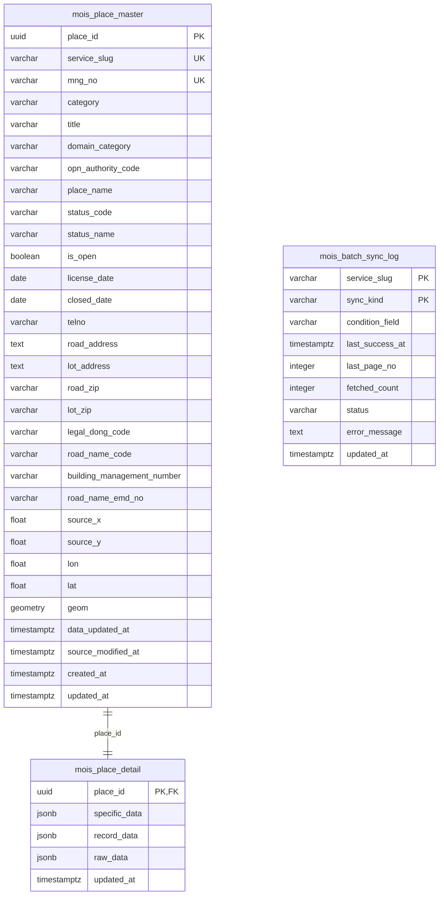
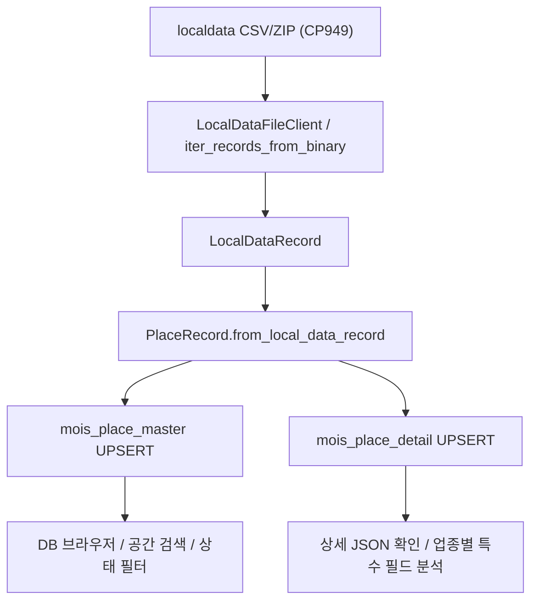

# MOIS DB 구조 정리

이 문서는 `mois` 패키지의 현재 PostgreSQL/PostGIS 저장 구조를 한눈에 보기 위한 설계 메모입니다. 기준 코드는 `src/mois/db.py`이며, 2026-05-16에 WSL 개발 DB에 연결해 현재 적재 상태도 함께 확인했습니다.

## 핵심 요약

- DB는 인허가 레코드를 `mois_place_master`와 `mois_place_detail`의 1:1 구조로 저장합니다.
- `mois_place_master`는 검색, 지도, 상태 필터, 주소/코드 연계에 필요한 공통 필드만 둡니다.
- `mois_place_detail`은 업종마다 달라지는 특수 필드와 원본 행을 JSONB로 보관합니다.
- `mois_batch_sync_log`는 파일/API 동기화 진행 상태와 증분 기준 시각을 저장하기 위한 로그 테이블입니다.
- 좌표는 원본 EPSG:5174 `(x, y)`를 `source_x`, `source_y`에 보존하고, WGS84 `(lon, lat)`와 PostGIS `geometry(Point, 4326)`을 별도로 저장합니다.
- UPSERT 기준은 `(service_slug, mng_no)`입니다. 원본 관리번호가 공백이면 DB 적재용으로만 `missing-mng-no-<sha256>` 대체 키를 만듭니다.

## 현재 적재 현황

2026-05-16 기준 WSL 개발 DB의 `/api/stats` 응답으로 확인한 값입니다.

| 항목 | 값 |
|---|---:|
| 전체 레코드 | 11,364,852 |
| 영업 상태 레코드 | 4,347,656 |
| 폐업/미상 레코드 | 7,017,196 |
| 좌표 보유 레코드 | 10,432,736 |
| 적재 업종 수 | 195 |

분류별 적재 건수:

| 분류 | 건수 |
|---|---:|
| 식품 | 5,177,595 |
| 생활 | 3,793,384 |
| 기타 | 813,486 |
| 건강 | 581,187 |
| 자원환경 | 507,626 |
| 동물 | 325,962 |
| 문화 | 165,612 |

상위 업종:

| 업종 slug | 업종명 | 분류 | 건수 |
|---|---|---|---:|
| `ecommerce_businesses` | 통신판매업 | 생활 | 3,021,164 |
| `general_restaurants` | 일반음식점 | 식품 | 2,274,143 |
| `instant_food_processors` | 즉석판매제조가공업 | 식품 | 753,692 |
| `tobacco_retailers` | 담배소매업 | 기타 | 654,103 |
| `rest_cafes` | 휴게음식점 | 식품 | 634,807 |
| `beauty_salons` | 미용업 | 생활 | 452,280 |
| `health_functional_food_general_retailers` | 건강기능식품일반판매업 | 식품 | 432,693 |
| `food_vending_machines` | 식품자동판매기업 | 식품 | 269,491 |
| `medical_device_sales_rental` | 의료기기판매(임대)업 | 건강 | 246,265 |
| `livestock_retail` | 축산판매업 | 식품 | 204,443 |
| `livestock_farming` | 가축사육업 | 동물 | 198,984 |
| `air_pollution_facility_installation` | 대기오염물질배출시설설치사업장 | 자원환경 | 139,327 |

## ERD



## 테이블별 역할

### `mois_place_master`

가장 자주 조회하는 공통 필드를 담는 마스터 테이블입니다. 지도 검색, 업종/상태 필터, 주소 검색, 행정구역/도로명주소 보강, 최신 수정일 정렬 같은 반복 조회가 이 테이블을 기준으로 일어납니다.

주요 설계 판단:

- 195개 업종별 특수 칼럼을 모두 펼치지 않습니다.
- 검색과 필터링에 필요한 공통 필드만 정규 칼럼으로 둡니다.
- 원본 좌표와 변환 좌표를 모두 보존합니다.
- 주소/코드 보강값은 원본에 항상 존재한다고 가정하지 않고 nullable 칼럼으로 둡니다.
- 원천 식별자는 `service_slug`와 `mng_no`의 조합입니다.

칼럼:

| 칼럼 | 타입 | 설명 |
|---|---|---|
| `place_id` | `uuid` | 내부 기본키. 상세 테이블과 조인하는 안정 키 |
| `service_slug` | `varchar(120)` | 업종 slug. 예: `hospitals`, `general_restaurants` |
| `mng_no` | `varchar(80)` | 관리번호. 원본 공백이면 적재용 대체 키 사용 |
| `category` | `varchar(80)` | 공식 카탈로그 분류. 예: 건강, 식품 |
| `title` | `varchar(160)` | 분류와 업종명을 합친 제목 |
| `domain_category` | `varchar(80)` | 여행/상권 분석용 도메인 분류 |
| `opn_authority_code` | `varchar(20)` | 개방자치단체코드. 법정동코드와 다르게 취급 |
| `place_name` | `varchar(300)` | 사업장명 |
| `status_code` | `varchar(20)` | 영업상태코드 |
| `status_name` | `varchar(80)` | 영업상태명 |
| `is_open` | `boolean` | 영업/정상 상태 추론값 |
| `license_date` | `date` | 인허가일자 |
| `closed_date` | `date` | 폐업일자 |
| `telno` | `varchar(40)` | 소재지 전화번호 |
| `road_address` | `text` | 도로명 주소 |
| `lot_address` | `text` | 지번 주소 |
| `road_zip` | `varchar(10)` | 도로명 우편번호 |
| `lot_zip` | `varchar(10)` | 지번 우편번호 |
| `legal_dong_code` | `varchar(10)` | 법정동/행정구역 보강 코드 후보 |
| `road_name_code` | `varchar(20)` | 도로명코드 보강값 |
| `building_management_number` | `varchar(30)` | 건물관리번호 보강값 |
| `road_name_emd_no` | `varchar(10)` | 도로명 읍면동 일련번호 계열 값 |
| `source_x` | `double precision` | 원본 EPSG:5174 X 좌표 |
| `source_y` | `double precision` | 원본 EPSG:5174 Y 좌표 |
| `lon` | `double precision` | WGS84 경도 |
| `lat` | `double precision` | WGS84 위도 |
| `geom` | `geometry(Point,4326)` | PostGIS 공간 검색용 점 |
| `data_updated_at` | `timestamptz` | 개방데이터 갱신시점 `DAT_UPDT_PNT` |
| `source_modified_at` | `timestamptz` | 원천데이터 최종수정시점 `LAST_MDFCN_PNT` |
| `created_at` | `timestamptz` | DB 생성 시각 |
| `updated_at` | `timestamptz` | DB 갱신 시각 |

### `mois_place_detail`

마스터 테이블에 펼치지 않은 데이터를 JSONB로 보관합니다. 업종별로 필드 수와 의미가 달라지는 문제를 이 테이블로 흡수합니다.

| 칼럼 | 타입 | 설명 |
|---|---|---|
| `place_id` | `uuid` | `mois_place_master.place_id`를 참조하는 기본키 |
| `specific_data` | `jsonb` | 공통 필드를 제외한 업종별 특수 필드 |
| `record_data` | `jsonb` | 날짜/시각/숫자/좌표가 타입 변환된 전체 필드 |
| `raw_data` | `jsonb` | CSV 원본 문자열 행 |
| `updated_at` | `timestamptz` | 상세 데이터 갱신 시각 |

`specific_data`는 업종별 탐색과 임시 분석에 유용하지만, 자주 필터링할 필드가 생기면 마스터 테이블 또는 별도 도메인 테이블로 승격할 후보입니다.

### `mois_batch_sync_log`

동기화 작업의 진행 상태를 저장합니다. 파일 전체 적재, OpenAPI 정보 조회, OpenAPI 이력 조회 등 작업 종류를 `sync_kind`로 구분합니다.

| 칼럼 | 타입 | 설명 |
|---|---|---|
| `service_slug` | `varchar(120)` | 동기화 대상 업종 |
| `sync_kind` | `varchar(40)` | `file`, `info`, `history` 등 작업 종류 |
| `condition_field` | `varchar(80)` | 증분 기준 필드. 예: `DAT_UPDT_PNT`, `LAST_MDFCN_PNT` |
| `last_success_at` | `timestamptz` | 마지막 성공 기준 시각 |
| `last_page_no` | `integer` | 마지막 처리 페이지 |
| `fetched_count` | `integer` | 가져온 레코드 수 |
| `status` | `varchar(30)` | 실행 상태 |
| `error_message` | `text` | 실패 메시지 |
| `updated_at` | `timestamptz` | 로그 갱신 시각 |

## 제약조건과 인덱스

| 테이블 | 이름 | 종류 | 대상 |
|---|---|---|---|
| `mois_place_master` | `mois_place_master_pkey` | PK | `place_id` |
| `mois_place_master` | `uq_mois_place_master_source` | UNIQUE | `(service_slug, mng_no)` |
| `mois_place_master` | `ix_mois_place_master_status` | btree | `(service_slug, status_code)` |
| `mois_place_master` | `ix_mois_place_master_authority` | btree | `opn_authority_code` |
| `mois_place_master` | `ix_mois_place_master_legal_dong` | btree | `legal_dong_code` |
| `mois_place_master` | `ix_mois_place_master_road_name` | btree | `road_name_code` |
| `mois_place_master` | `ix_mois_place_master_geom` | GiST | `geom` |
| `mois_place_detail` | `mois_place_detail_pkey` | PK | `place_id` |
| `mois_place_detail` | `mois_place_detail_place_id_fkey` | FK | `place_id -> mois_place_master.place_id` |
| `mois_place_detail` | `ix_mois_place_detail_specific_gin` | GIN | `specific_data` |
| `mois_batch_sync_log` | `mois_batch_sync_log_pkey` | PK | `(service_slug, sync_kind)` |

## 적재 흐름



변환 규칙:

- CSV 인코딩은 CP949를 기본으로 봅니다.
- 빈 문자열은 의미 없는 빈 값이면 `None`으로 보존합니다.
- 날짜는 `date`, 시각은 KST `datetime`으로 변환합니다.
- 숫자 필드는 `int` 또는 `float`로 변환합니다.
- 좌표는 EPSG:5174 `(x, y)` 원본을 보존하고 WGS84 `(lon, lat)`를 추가합니다.
- 폐업/취소 레코드는 삭제하지 않고 상태와 폐업일자를 갱신합니다.

## 조회 패턴

### DB 브라우저 목록 조회

`apps/db_browser/backend/app.py`의 `/api/places`는 다음 조건을 조합합니다.

- `service_slug`
- `category`
- `is_open`
- `place_name`, `road_address`, `lot_address`, `mng_no`의 부분 문자열 검색

현재 정렬은 `updated_at desc`, `place_name` 기준입니다.

### 공간 검색

```sql
select place_name, road_address
from mois_place_master
where service_slug = 'hospitals'
  and is_open is true
  and ST_DWithin(
      geom::geography,
      ST_SetSRID(ST_MakePoint(126.9780, 37.5665), 4326)::geography,
      1000
  );
```

공간 검색은 `geom`의 GiST 인덱스가 핵심입니다. 거리 계산을 `geography`로 캐스팅하는 쿼리는 정확도는 좋지만 비용이 커질 수 있으므로, 대량 조회에서는 bounding box 선필터를 함께 검토할 만합니다.

### JSONB 특수 필드 탐색

```sql
select m.place_name, d.specific_data
from mois_place_master m
join mois_place_detail d on d.place_id = m.place_id
where m.service_slug = 'hospitals'
  and d.specific_data ? 'SCKBD_CNT';
```

자주 쓰는 JSONB 필드는 계속 JSONB에 둘지, 별도 칼럼/도메인 테이블로 승격할지 사용 빈도와 쿼리 비용을 보고 결정합니다.

## 현재 구조의 장점

- 195개 업종을 한 스키마로 처리하면서도 공통 조회 성능을 확보합니다.
- 업종별 특수 필드 변화에 강합니다.
- 원본 좌표와 변환 좌표를 모두 보존해 재검증과 공간 분석이 가능합니다.
- 원본 문자열(`raw_data`)과 타입 변환 결과(`record_data`)를 같이 보관해 로더 버그를 추적하기 쉽습니다.
- DB 브라우저는 마스터 테이블 중심으로 빠르게 목록을 만들고, 필요할 때만 상세 JSON을 읽습니다.

## 고민할 지점

### 1. 검색 성능

현재 주소/사업장명 검색은 `ilike '%검색어%'`입니다. 1,100만 건 규모에서는 다음을 검토할 만합니다.

- `pg_trgm` 확장과 trigram GIN/GiST 인덱스
- `place_name`, `road_address`, `lot_address`, `mng_no` 통합 검색 칼럼
- 검색어 없는 대량 조회 제한 정책

### 2. 시간 축과 이력

현재 마스터/상세 테이블은 최신 상태 중심입니다. 이력 데이터까지 분석하려면 별도 이력 테이블이 필요합니다.

후보:

- `mois_place_snapshot`: 동기화 시점별 스냅샷
- `mois_place_status_history`: 영업상태/폐업일자 변화 이력
- `mois_openapi_history_raw`: OpenAPI history 원본 보관

### 3. JSONB 필드 승격 기준

`specific_data`는 유연하지만, 반복 필터 조건이 되면 비용이 커질 수 있습니다.

승격 후보 기준:

- 여러 업종에 공통으로 등장한다.
- UI 필터나 분석 쿼리에 자주 쓰인다.
- 타입이 안정적이고 의미가 분명하다.
- 주소/지도/상권 분석과 직접 연결된다.

### 4. 주소 보강

법정동코드, 도로명코드, 건물관리번호는 인허가 공통 필드에 항상 들어 있지 않습니다.

보강 우선순위:

1. 원본 필드에 이미 있는 코드 사용
2. 도로명주소 API/주소 DB로 주소 기반 보강
3. 좌표 기반 법정구역 공간조인
4. 보강값과 원본값을 구분해 저장

### 5. 파티셔닝

현재 1,100만 건 규모에서는 단일 테이블도 가능하지만, 전체 재적재와 대량 분석이 잦아지면 파티셔닝을 검토할 수 있습니다.

후보:

- `service_slug` 해시 파티션
- `category` 리스트 파티션
- `data_updated_at` 또는 `source_modified_at` 범위 파티션

다만 조회 패턴이 업종/분류 중심인지, 시간 중심인지 먼저 확인한 뒤 결정하는 것이 좋습니다.

### 6. 동기화 로그 실사용

`mois_batch_sync_log`는 모델은 있으나, 운영 동기화 루틴에서 얼마나 일관되게 쓰는지 점검이 필요합니다.

확인할 것:

- 파일 전체 적재와 OpenAPI 증분 적재의 `sync_kind` 명명 규칙
- 실패 후 재개 기준
- `DAT_UPDT_PNT`와 `LAST_MDFCN_PNT`를 분리 기록하는 방식
- 진행 파일(`artifacts/*.jsonl`)과 DB 로그의 역할 분담

## 결론

현재 구조는 “공통 검색 필드는 정규화, 업종별 특수 필드는 JSONB”라는 방향이 분명합니다. 여행/상권 분석과 DB 브라우저에는 이 구조가 당장 맞고, 다음 단계의 핵심은 검색 인덱스, 이력 테이블, 주소 보강, 자주 쓰는 JSONB 필드 승격 기준을 정하는 일입니다.
