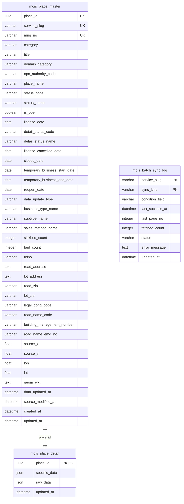
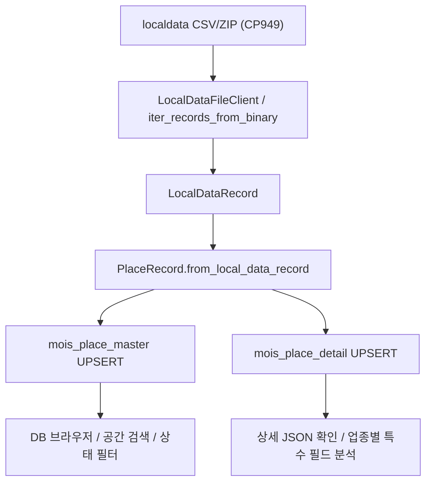

# MOIS DB 구조 정리

이 문서는 `mois` 패키지의 현재 SQLite/SpatiaLite 저장 구조를 한눈에 보기 위한 설계 메모입니다. 기준 코드는 `src/mois/db.py`입니다.

## 핵심 요약

- DB는 인허가 레코드를 `mois_place_master`와 `mois_place_detail`의 1:1 구조로 저장합니다.
- `mois_place_master`는 검색, 지도, 상태 필터, 주소/코드 연계에 필요한 공통 필드만 둡니다.
- `mois_place_detail`은 컬럼으로 승격하지 않은 특수 필드와 원본 필드만 SQLite JSON으로 보관합니다.
- `mois_batch_sync_log`는 파일/API 동기화 진행 상태와 증분 기준 시각을 저장하기 위한 로그 테이블입니다.
- 좌표는 원본 EPSG:5174 `(x, y)`를 `source_x`, `source_y`에 보존하고, WGS84 `(lat, lon)`와 `geom_wkt`를 별도로 저장합니다.
- SpatiaLite 확장을 로드할 수 있으면 `mois_place_master.geom` 컬럼과 공간 인덱스를 추가합니다.
- UPSERT 기준은 `(service_slug, mng_no)`입니다. 원본 관리번호가 공백이면 DB 적재용으로만 `missing-mng-no-<sha256>` 대체 키를 만듭니다.

## ERD



## `mois_place_master`

가장 자주 조회하는 공통 필드를 담는 마스터 테이블입니다. 지도 검색, 업종/상태 필터, 주소 검색, 행정구역/도로명주소 보강, 최신 수정일 정렬 같은 반복 조회가 이 테이블을 기준으로 일어납니다.

주요 설계 판단:

- 195개 업종별 특수 칼럼을 모두 펼치지 않습니다.
- 검색과 필터링에 필요한 공통 필드만 정규 칼럼으로 둡니다.
- 원본 좌표와 변환 좌표를 모두 보존합니다.
- 주소/코드 보강값은 원본에 항상 존재한다고 가정하지 않고 nullable 칼럼으로 둡니다.
- 원천 식별자는 `service_slug`와 `mng_no`의 조합입니다.

주요 인덱스:

| 이름 | 대상 |
|---|---|
| `uq_mois_place_master_source` | `(service_slug, mng_no)` |
| `ix_mois_place_master_status` | `(service_slug, status_code)` |
| `ix_mois_place_master_detail_status` | `(service_slug, detail_status_code)` |
| `ix_mois_place_master_authority` | `opn_authority_code` |
| `ix_mois_place_master_legal_dong` | `legal_dong_code` |
| `ix_mois_place_master_road_name` | `road_name_code` |
| `ix_mois_place_master_lat_lon` | `(lat, lon)` |
| `ix_mois_place_master_subtype` | `(service_slug, subtype_name)` |
| `ix_mois_place_master_sales_method` | `sales_method_name` |

SpatiaLite가 활성화된 DB에는 `geom` 컬럼과 `idx_mois_place_master_geom` 계열 공간 인덱스 테이블이 추가됩니다.

## `mois_place_detail`

마스터 테이블에 펼치지 않은 데이터를 SQLite JSON으로 보관합니다. 업종별로 필드 수와 의미가 달라지는 문제를 이 테이블로 흡수하되, 반복 필터가 되는 값은 마스터 컬럼으로 승격합니다.

| 칼럼 | 설명 |
|---|---|
| `place_id` | `mois_place_master.place_id`를 참조하는 기본키 |
| `specific_data` | 컬럼으로 승격하지 않은 업종별 특수 필드 |
| `raw_data` | 컬럼으로 승격하지 않은 CSV 원본 문자열 필드 |

JSON 필드는 원본 보존과 상세 확인에 적합합니다. API의 `recordData` 응답은 마스터 컬럼과 `specific_data`를 합쳐 재구성합니다. 반복 필터 조건이 되면 표현식 인덱스보다 마스터 컬럼 승격을 우선 검토합니다.

```sql
select m.place_name, d.specific_data
from mois_place_master m
join mois_place_detail d on d.place_id = m.place_id
where m.sickbed_count >= 50;
```

## 적재 흐름



변환 규칙:

- CSV 인코딩은 CP949를 기본으로 봅니다.
- 빈 문자열은 의미 없는 빈 값이면 `None`으로 보존합니다.
- 날짜는 `date`, 시각은 KST `datetime`으로 변환합니다.
- 숫자 필드는 `int` 또는 `float`로 변환합니다.
- 좌표는 EPSG:5174 `(x, y)` 원본을 보존하고 WGS84 `(lat, lon)`를 추가합니다.
- 폐업/취소 레코드는 삭제하지 않고 상태와 폐업일자를 갱신합니다.

## 조회 패턴

### DB 브라우저 목록 조회

`packages/mois-debug-ui/src/mois_debug_ui/backend/app.py`의 `/api/places`는 다음 조건을 조합합니다.

- `service_slug`
- `category`
- `is_open`
- `place_name`, `road_address`, `lot_address`, `mng_no`의 부분 문자열 검색

현재 정렬은 `updated_at desc`, `place_name` 기준입니다.

### 공간 검색

SpatiaLite가 활성화된 DB에서는 `geom` 컬럼을 사용할 수 있습니다. 확장을 사용할 수 없는 환경에서는 `lat`, `lon`의 bounding box 선필터와 Python 거리 계산을 조합합니다.

```sql
select place_name, road_address
from mois_place_master
where service_slug = 'hospitals'
  and is_open = 1
  and lat between 37.55 and 37.58
  and lon between 126.96 and 127.00;
```

## 고민할 지점

### 1. 검색 성능

주소/사업장명 검색은 대량 테이블에서 비용이 커질 수 있습니다.

- 사업장명/주소 통합 검색용 FTS5 테이블
- 검색어 없는 대량 조회 제한 정책
- 업종/분류 필터와 검색어를 함께 쓰는 UI 흐름

### 2. 시간 축과 이력

현재 마스터/상세 테이블은 최신 상태 중심입니다. 이력 데이터까지 분석하려면 별도 이력 테이블이 필요합니다.

후보:

- `mois_place_snapshot`: 동기화 시점별 스냅샷
- `mois_place_status_history`: 영업상태/폐업일자 변화 이력
- `mois_openapi_history_raw`: OpenAPI history 원본 보관

### 3. JSON 필드 승격 기준

`specific_data`는 유연하지만, 반복 필터 조건이 되면 비용이 커질 수 있습니다.
2026-05-18에 195개 파일 12,046,780건을 다시 분석해 상세 영업상태, 데이터 갱신 구분,
업태/세부업종, 전자상거래 판매 방식, 의료·숙박 규모 필드를 `mois_place_master` 컬럼으로 승격했습니다.
분석 근거는 `docs/json-field-promotion.md`에 별도로 정리했습니다.

승격 후보 기준:

- 여러 업종에 공통으로 등장한다.
- UI 필터나 분석 쿼리에 자주 쓰인다.
- 타입이 안정적이고 의미가 분명하다.
- 주소/지도/상권 분석과 직접 연결된다.

### 4. 주소 보강

법정동코드, 도로명코드, 건물관리번호는 인허가 공통 필드에 항상 들어 있지 않습니다.

보강 우선순위:

1. 원본 필드에 이미 있는 코드 사용
2. 도로명주소 API/주소 DB로 주소 기반 보강
3. 좌표 기반 법정구역 공간조인
4. 보강값과 원본값을 구분해 저장
